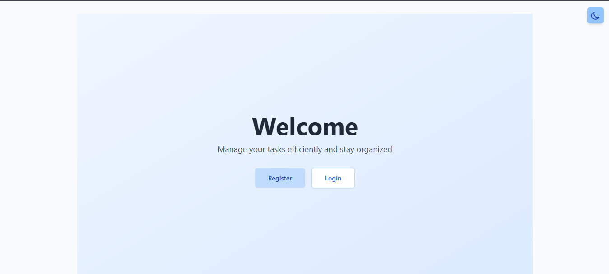
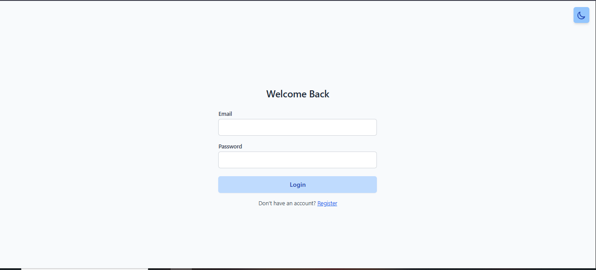
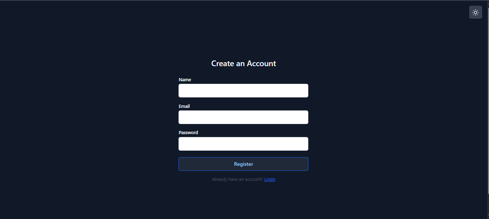
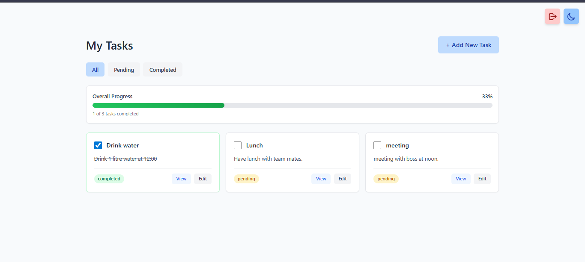
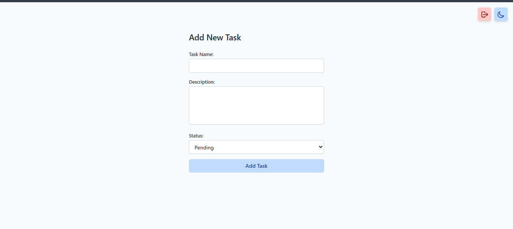
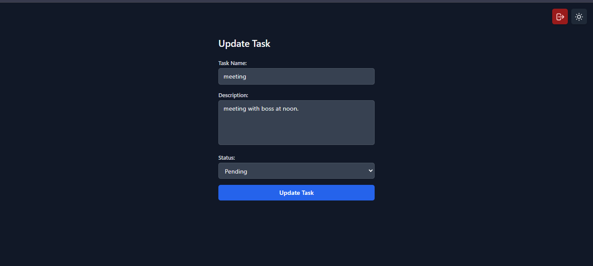

# Task Managing App 

A full-stack Task Managing application where users can register, log in, and manage their personal tasks.  
Each user can create, update, delete, and mark tasks as completed. Tasks are private and accessible only to the authenticated user.

## Features

- User authentication (JWT + password hashing)
- Create, update, delete tasks
- Mark tasks as completed
- View all tasks for logged-in user
- Filter tasks (All / Completed / Pending)
- Clean and responsive UI

### Bonus Features
- Dark / Light mode 

## Tech Stack

### Frontend
- React
- Axios
- React Router
- Tailwind CSS

### Backend
- Node.js
- Express.js
- MongoDB + Mongoose
- JWT Authentication
- bcrypt
- dotenv

## Project Structure

task-manager/
│
├── backend/
│ ├── controllers/
│ ├── routes/
│ ├── models/
│ ├── middlewares/
│ ├── DB/
│ ├── index.js
│ └── package.json
│
├── frontend/
│ ├── src/
│ │ ├── pages/
│ │ ├── components/
│ │ ├── api/
│ │ ├── App.js
│ │ └── index.js
│ └── package.json
|
|── screenshots/
|
└── README.md

## Authentication Flow

- Users register with email and password
- Passwords are hashed using bcrypt
- JWT is issued on login
- JWT is required for all task-related API requests
- Each task is associated with a user ID
- Users can access **only their own tasks**

## API Endpoints

### Auth
POST /api/auth/register → Register user
POST /api/auth/login → Login user

### Tasks 
GET /api/task/list → Get all tasks
POST /api/task/add → Create task
PUT /api/task/edit/:id → Update task
DELETE /api/task/:id → Delete task
PATCH /api/task/view/:id → View a task

## Getting Started

### 1. Clone the Repository

git clone https://github.com/shehanastt/task-manager
cd task-manager

### 2. Backend Setup

cd backend
npm install
npm run dev

### 3. Frontend Setup

cd frontend
npm install
npm run dev

## Screenshots

### Home

### Login

### Register

### Dashboard

### Add Task

### Edit Task
